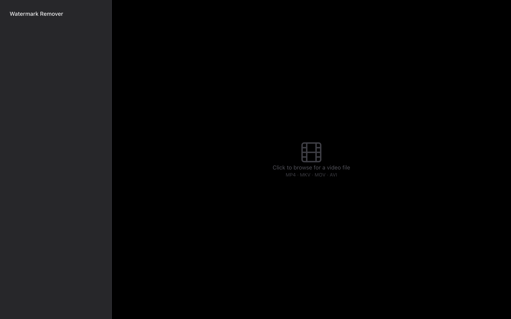
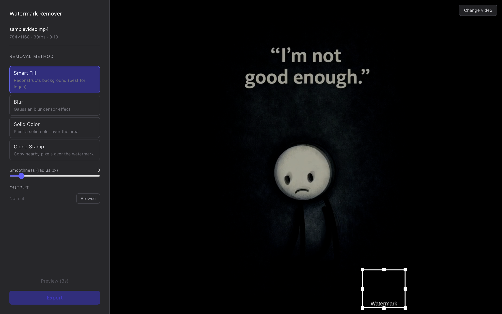
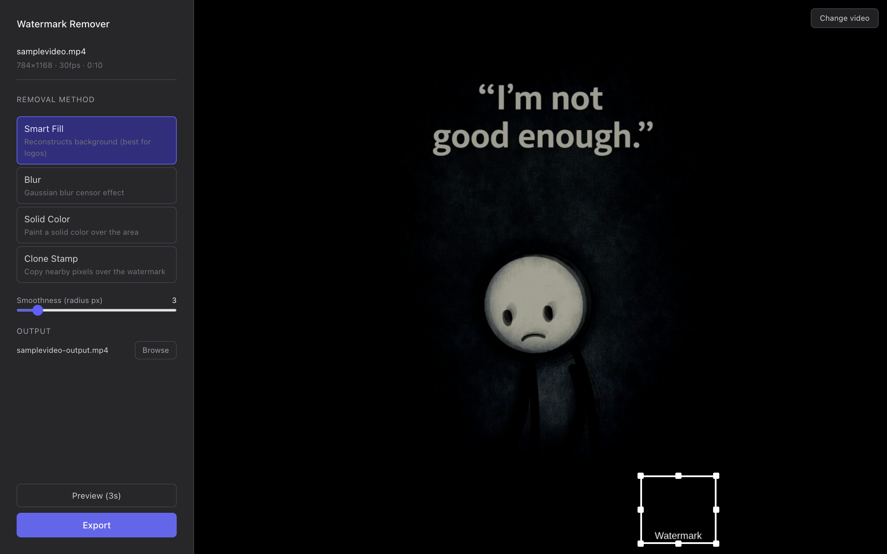
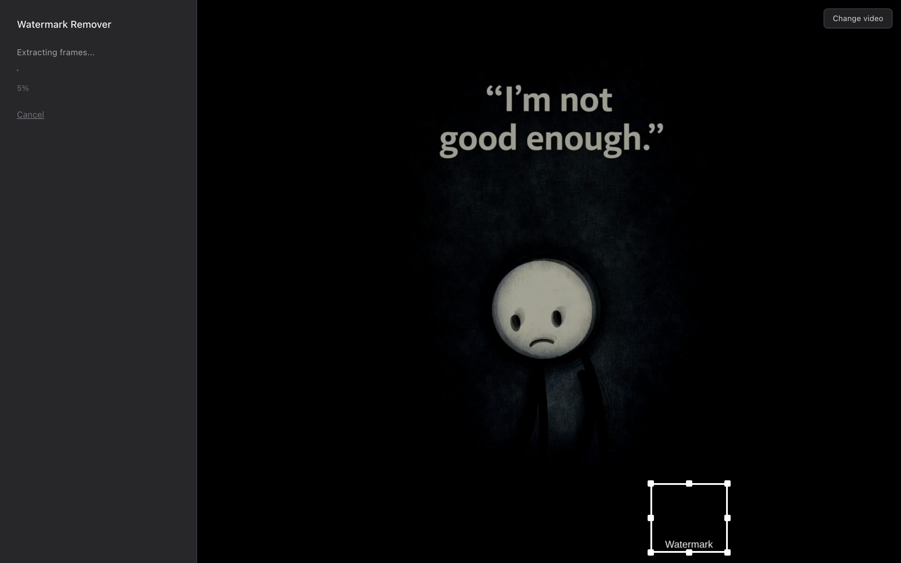
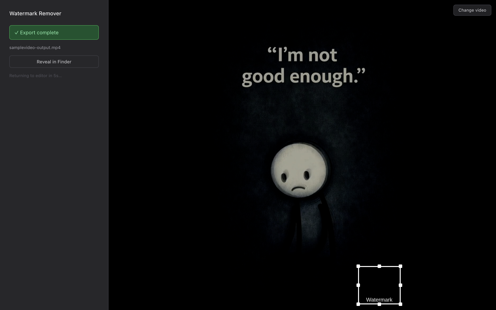

# Watermark Remover

A cross-platform desktop application for removing static watermarks from video files. Draw a box over the watermark, pick a removal method, and export a clean output — no cloud upload, no subscription, everything runs locally.


---

## Features

- **Interactive ROI selector** — drag-to-resize bounding box directly on the video frame via Konva.js canvas
- **Four removal engines** — Inpainting (TELEA), Gaussian Blur, Solid Fill, Clone Stamp
- **3-second quick preview** — test your settings on a short clip before committing to a full render
- **Real-time progress bar** — frame-by-frame progress streamed from the Python backend via IPC
- **Multi-core processing** — Python `multiprocessing.Pool` saturates all CPU cores automatically
- **Audio preserved** — original audio track is muxed back into the output with zero re-encoding
- **Zero temp files** — all intermediate frames are deleted from disk on completion or error
- **Fully offline** — no internet connection; no data ever leaves your machine

---

## Screenshots

| Launch screen | Video loaded — pick a method |
|:---:|:---:|
|  |  |

| Ready to export | Processing in progress | Export complete |
|:---:|:---:|:---:|
|  |  |  |

---

## Prerequisites

| Dependency | Version | Install |
|---|---|---|
| Node.js | 18+ | [nodejs.org](https://nodejs.org) |
| Python | 3.11+ | [python.org](https://python.org) |
| FFmpeg | 6+ | `brew install ffmpeg` / `choco install ffmpeg` / `apt install ffmpeg` |

---

## Quick Start

### 1. Clone

```bash
git clone https://github.com/YOUR_USERNAME/watermark-remover.git
cd watermark-remover
```

### 2. Install Node dependencies

```bash
npm install
cd renderer && npm install && cd ..
```

### 3. Set up the Python backend

```bash
python3 -m venv backend/.venv
source backend/.venv/bin/activate        # macOS/Linux
# backend\.venv\Scripts\activate         # Windows

pip install -r backend/requirements.txt
```

### 4. Validate the environment

```bash
python scripts/validate_env.py
# Expected: EXIT:0 — all checks passed
```

### 5. Run in development mode

```bash
npm run dev
```

The Electron window opens automatically once Vite's dev server is ready at `http://localhost:5173`.

### 6. Build a distributable

```bash
npm run dist
# Output: dist/  →  .dmg (macOS) | .exe (Windows) | .AppImage (Linux)
```

See [RELEASING.md](RELEASING.md) for code signing, GitHub Actions CI/CD, versioning, and publishing a GitHub Release.

---

## Usage

See [HELP.md](HELP.md) for a step-by-step guide with screenshots and tips for each removal method.

---

## Project Layout

See [PROJECT_STRUCTURE.md](PROJECT_STRUCTURE.md) for a full annotated map of every file and directory.

---

## Testing

See [TESTING.md](TESTING.md) for how to run the full test suite (backend + renderer) and what each test covers.

---

## Tech Stack

| Layer | Technology |
|---|---|
| Desktop shell | Electron 41 |
| UI framework | React 19 + TypeScript |
| Build tool | Vite 8 |
| Canvas | Konva.js / react-konva |
| Styling | Tailwind CSS v4 |
| Backend | Python 3.11+ |
| Video processing | FFmpeg 6+ via ffmpeg-python |
| Image processing | OpenCV-contrib (cv2) + NumPy |
| Schema validation | Pydantic v2 |
| Parallelism | Python multiprocessing.Pool |

---

## Contributing

1. Fork the repository
2. Create a feature branch: `git checkout -b feat/my-feature`
3. Run tests before committing: `npm run test:backend` and `cd renderer && npm run test:run`
4. Open a pull request with a clear description of the change

Please follow existing code style. New Python code should pass `ruff` linting. New TypeScript should have no `tsc` errors.

---

## License

This project is licensed under the **MIT License** — see [LICENSE](LICENSE) for the full text.

```
MIT License

Copyright (c) 2026 cpanda

Permission is hereby granted, free of charge, to any person obtaining a copy
of this software and associated documentation files (the "Software"), to deal
in the Software without restriction, including without limitation the rights
to use, copy, modify, merge, publish, distribute, sublicense, and/or sell
copies of the Software, and to permit persons to whom the Software is
furnished to do so, subject to the following conditions:

The above copyright notice and this permission notice shall be included in all
copies or substantial portions of the Software.

THE SOFTWARE IS PROVIDED "AS IS", WITHOUT WARRANTY OF ANY KIND, EXPRESS OR
IMPLIED, INCLUDING BUT NOT LIMITED TO THE WARRANTIES OF MERCHANTABILITY,
FITNESS FOR A PARTICULAR PURPOSE AND NONINFRINGEMENT. IN NO EVENT SHALL THE
AUTHORS OR COPYRIGHT HOLDERS BE LIABLE FOR ANY CLAIM, DAMAGES OR OTHER
LIABILITY, WHETHER IN AN ACTION OF CONTRACT, TORT OR OTHERWISE, ARISING FROM,
OUT OF OR IN CONNECTION WITH THE SOFTWARE OR THE USE OR OTHER DEALINGS IN THE
SOFTWARE.
```

---

## Acknowledgements

- [OpenCV](https://opencv.org/) — computer vision library powering all removal algorithms
- [FFmpeg](https://ffmpeg.org/) — video demuxing, frame extraction, and reassembly
- [Electron](https://www.electronjs.org/) — cross-platform desktop shell
- [Konva.js](https://konvajs.org/) — interactive canvas for the ROI selector
